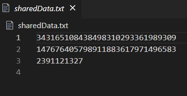
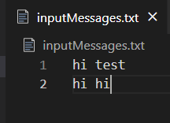
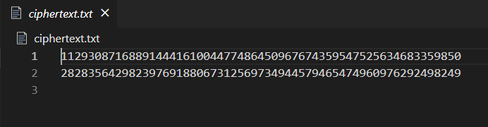
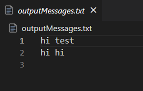
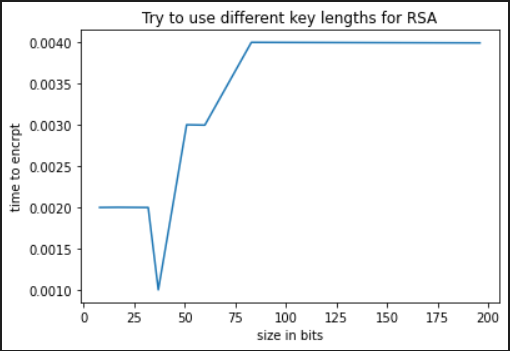
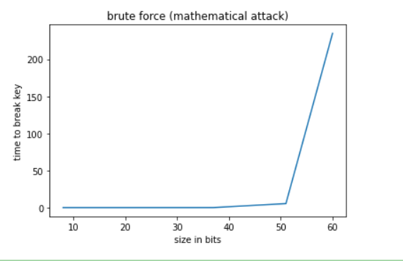

# RSA

RSA Encryption & Decryption implementation.
<p align="center">
  <a href="" rel="noopener">
 </a>
</p>
## 🏁 Get Started <a name = "Install"></a>

```
https://github.com/gaserashraf/RSA.git
```

## 💻 Built Using <a name = "tech"></a>

- **python**

## 📷 Screenshots

<div name="Screenshots" align="center">
<h2>RSA Parameters p,q,e</h2>
</a>

 <hr>
 <h2>Sample Test case</h2>
   </a>
  
  </a>
   </a>
    <hr>
   <h2>Time to Encryption vs key size</h2>
</a>

 <hr>
 <h2>Time to break key vs key size</h2>
</a>
</div>
